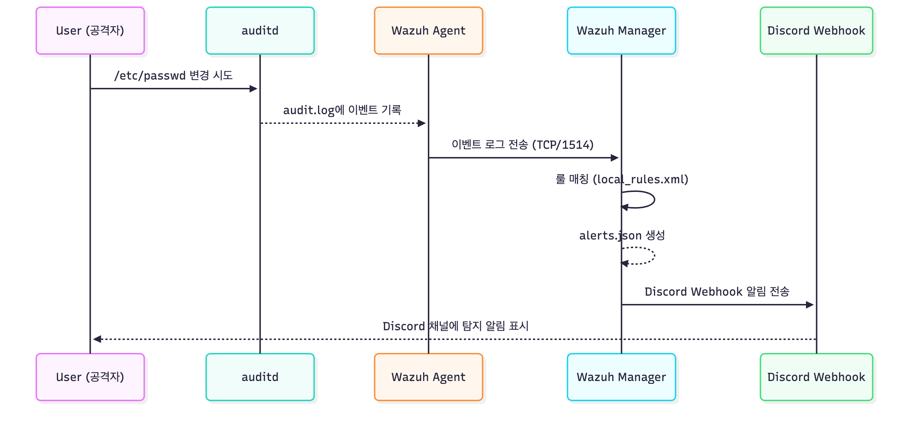
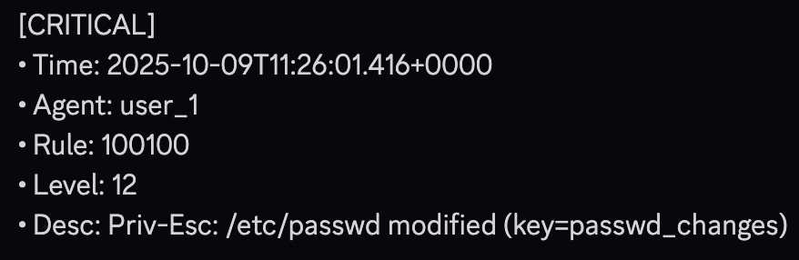
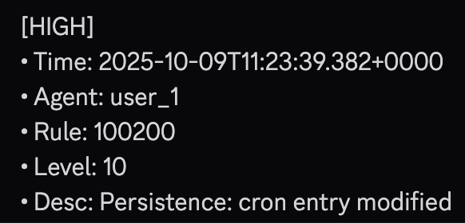
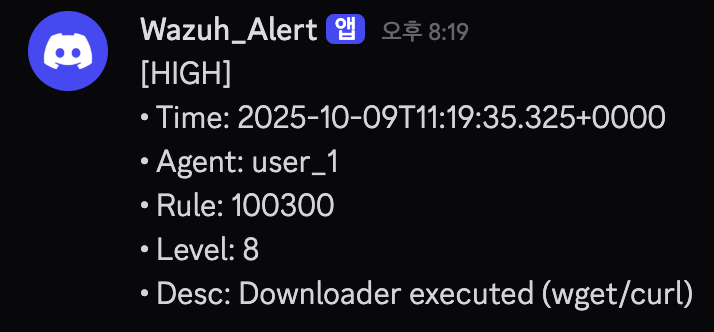

# 🛡️ Linux Endpoint Sentinel

## 📘 프로젝트 개요
**Linux-Endpoint-Sentinel**은 `Wazuh`와 `auditd`를 기반으로 **리눅스 엔드포인트에서 발생하는 보안 이벤트를 실시간 탐지하고 Discord로 알림을 전송하는 시스템**입니다.

---

## 🧩 아키텍처 구성



```
┌────────────────────┐
│     Endpoint       │
│  (auditd + agent)  │
└────────┬───────────┘
         │ audit.log
         ▼
┌────────────────────┐
│   Wazuh Manager    │
│ (analysisd + rule) │
└────────┬───────────┘
         │ alerts.json
         ▼
┌────────────────────┐
│ Discord Webhook    │
│   (Python script)  │
└────────────────────┘
```

---

## 📁 디렉터리 구조

```
Linux-Endpoint-Sentinel/
├── Wazuh_Agent/           # 엔드포인트 측 (auditd + agent 설정)
│   ├── agent-setup.md
│   ├── audit/
│   │   └── 10-endpoint.rules
│   └── ossec/
│       └── localfile.conf
│
├── Wazuh_Server/          # 매니저 측 (룰/통합/디스코드 연동)
│   ├── docker-compose.yml
│   ├── ossec.conf
│   ├── local_rules.xml
│   ├── wazuh_discord.py
│   ├── docs/
│   │   ├── detection_flow.png
│   │   └── README.md
│   └── logs/
│       ├── passwd_changes_alert.json
│       ├── cron_changes_alert.json
│       ├── downloader_exec_alert.json
│       └── README.md
│
└── README.md              # 전체 프로젝트 개요 (현재 파일)
```

---

## ⚙️ 주요 기능
| 기능 | 설명 |
|------|------|
| **커널 이벤트 감시** | auditd로 `/etc/passwd`, `cron`, `wget/curl` 등의 행위 감시 |
| **보안 이벤트 탐지** | Wazuh Manager의 커스텀 룰 기반 탐지 |
| **알림 전송** | Python 스크립트로 Discord Webhook 알림 전송 |
| **시각화 연동 (선택)** | Kibana 또는 Grafana로 시각화 확장 가능 |

---

## 🚨 탐지 로그 예시

### 1️⃣ Privilege Escalation — `/etc/passwd` 변경 시도

**룰 ID:** 100100  
**설명:** `/etc/passwd` 파일이 변경될 때 탐지  
**탐지 키워드:** `passwd_changes`  



### 2️⃣ Persistence — Crontab 수정 탐지

**룰 ID:** 100200  
**설명:** 사용자가 Crontab을 수정하거나 새로운 항목을 추가했을 때 탐지  
**탐지 키워드:** `cron_changes`  




### 3️⃣ Downloader Execution — curl/wget 실행 탐지

**룰 ID:** 100300  
**설명:** 외부에서 파일을 다운로드하거나 C2 통신 가능성이 있는 명령어 실행 시 탐지  
**탐지 키워드:** `downloader_exec`  



---

## 🚀 실행 방법 (요약)

1️⃣ **Agent 설치**
```bash
cd Wazuh_Agent
sudo ./setup_agent.sh
```

2️⃣ **Manager 실행**
```bash
cd Wazuh_Server
docker compose up -d
```

3️⃣ **테스트 이벤트 생성**
```bash
sudo sh -c 'echo "#test" >> /etc/passwd'
curl --version
```

4️⃣ **결과 확인**
- Discord 채널로 알림 도착 여부 확인
- `/var/ossec/logs/alerts/alerts.json`에서 탐지 로그 확인

---

## 🧠 프로젝트 목적
- **엔드포인트 실시간 보안 감시 자동화**
- **SIEM 구축 전 단계에서 경량 탐지 환경 구성**
- **Wazuh 및 auditd 기반 탐지 체계 이해**

---

## 📌 참고
- [Wazuh 공식 문서](https://documentation.wazuh.com/)
- [Auditd 매뉴얼](https://access.redhat.com/documentation/en-us/red_hat_enterprise_linux/7/html/security_guide/sec-auditd)
- [Discord Webhook API](https://discord.com/developers/docs/resources/webhook)

---

## 🧩 License
이 프로젝트는 **MIT License** 하에 배포됩니다.
