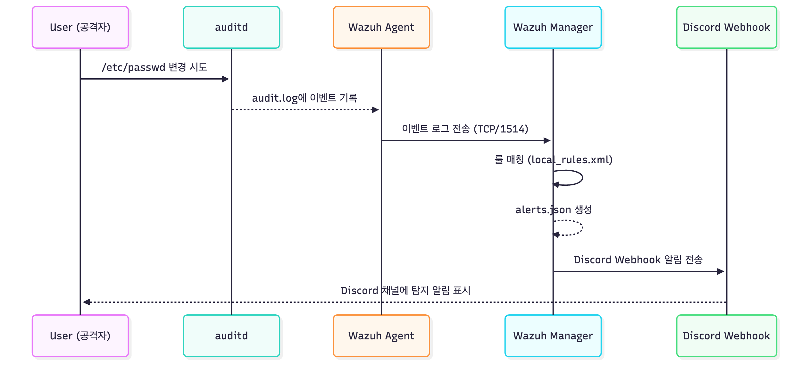

# 내부 탐지 흐름 (Internal Detection Flow)

이 문서는 Wazuh + auditd 기반의 엔드포인트 탐지 파이프라인이 **서버(매니저) 내부에서 어떻게 흐르는지** 단계별로 설명합니다. 

---

## 1. 전체 개요 (한 줄 요약)

에이전트에서 발생한 커널/로그 이벤트 → auditd → Wazuh agent 수집 → Wazuh manager(analysisd) 룰 매칭 → alerts.json 생성 → integratord / 포워더가 Discord로 전송

---

## 🧱 탐지 흐름 다이어그램



---

## 2. 컴포넌트별 역할

- **auditd (Agent 측)**  
  - 커널 레벨 syscall 감시(파일 변경, execve 등).  
  - `rules.d`에 등록된 룰대로 `/var/log/audit/audit.log`에 기록.  
  - 예: `-w /etc/passwd -p wa -k passwd_changes`, `-a always,exit -F arch=b64 -S execve -F exe=/usr/bin/curl -F auid>=1000 -k downloader_exec`

- **Wazuh Agent (Agent 측)**  
  - `logcollector`가 `/var/log/audit/audit.log`를 모니터링.  
  - 새 로그 라인 발견 시 매니저로 전송(secure TCP).  
  - 설정: `/var/ossec/etc/ossec.conf` 내 `<localfile>` 블록에 `audit` 설정 필요.

- **Wazuh Manager (Manager 측)**  
  - `analysisd`가 수신된 이벤트에 대해 디코더/룰로 분석.  
  - 룰 매칭 시 `alerts.json`에 JSON 포맷으로 alert 기록.  
  - 커스텀 룰은 `etc/rules/local_rules.xml` 또는 `/var/ossec/etc/rules/local_rules.xml` 등에 위치.

- **Integrator / Forwarder**  
  - `wazuh-integratord` 또는 별도 Python 스크립트가 `alerts.json`를 tail/구독.  
  - 필터(레벨/룰ID/그룹) 적용 후 Discord Webhook으로 전송.  
  - 중복제거, 로테이션(inode 변경) 처리, 429 처리 필요.

- **Discord (알림 채널)**  
  - 수신된 메시지로 실제 운영자에게 알림 발송.  
  - 민감정보는 로그 단계에서 마스킹/제거 권장.

---

## 3. 데이터 흐름(세부) — 이벤트 발생 시점부터 전송까지

1. **룰에 의한 이벤트 기록**  
   - 커널이 syscall을 감지 → auditd가 규칙에 따라 `/var/log/audit/audit.log`에 이벤트 기록.  
   - 이벤트 예: `type=SYSCALL ... key="passwd_changes"`.

2. **Agent의 수집**  
   - `logcollector`가 해당 파일을 '분석(Analyzing file)' 로그와 함께 읽음.  
   - 각 라인은 agent->manager로 전송(암호화된 TCP).

3. **Manager의 분석**  
   - `analysisd`가 디코더를 통해 필드를 파싱.  
   - `local_rules.xml` 의 `<match>` 값(예: `passwd_changes`)과 비교해 룰 매칭.  
   - 매칭 시 `alerts.json` 에 alert 객체로 append.

4. **Alert 파일 처리**  
   - `integratord`(또는 사용자 포워더)가 alerts.json을 tail하며 새 JSON 객체를 읽음.  
   - 파일 로테이션 대응: inode 변경 시 파일 재오픈.  
   - 중복(같은 id 또는 same_key)에 대한 필터링 적용.

5. **전송/실패 처리**  
   - Discord 전송: HTTP POST (JSON payload).  
   - 실패(HTTP 5xx, 네트워크) 시 재시도, 429은 `retry_after` 사용.  
   - 전송 성공 로그는 `/var/ossec/logs/integrations.log`에 남김.

---

## 4. 핵심 설정(검토 포인트)
- **auditd (Agent)**
  - 룰 위치: `/etc/audit/rules.d/*.rules`
  - 즉시 적용: `augenrules --load` 또는 `auditctl -l` (임시)
  - 권장: `auid>=1000`, `success=1` 필터로 노이즈 감소

- **Wazuh Agent**
  - `/var/ossec/etc/ossec.conf` 내:
    ```xml
    <localfile>
      <log_format>audit</log_format>
      <location>/var/log/audit/audit.log</location>
    </localfile>
    ```

- **Wazuh Manager**
  - 사용자 룰: `/var/ossec/etc/rules/local_rules.xml`
  - 중복 억제: `<same_key>audit.key</same_key>` 등 사용 가능
  - integrator 설정: `<integration>` 블록에 `duplicates` 옵션

- **Forwarder / Script**
  - alerts.json tail에서 inode 변경 감지
  - 필터: MIN_LEVEL, MATCH_RULE_IDS, MATCH_GROUPS
  - 에러/재시도 로직 포함

---

## 5. 타이밍/딜레이 기대치
- auditd 기록 → agent 전송: **대체로 실초~수초 이내** (네트워크/부하 영향)
- manager 분석 → alerts.json 기록: **수초 이내**
- forwarder → Discord 전송: **수초 이내**, 레이트리밋/네트워크로 지연 가능

실 운영에서는 end-to-end 지연 1–10초 정도가 정상 범위지만, 환경에 따라 더 길어질 수 있음.

---

## 6. 흔한 문제와 점검 명령
- **audit 로그가 찍히지 않을 때**
  - `sudo auditctl -l`
  - `sudo systemctl status auditd`
  - `sudo tail -n 50 /var/log/audit/audit.log`

- **Agent가 audit.log를 수집하지 않을 때**
  - `/var/ossec/etc/ossec.conf` 내 `<localfile>` 확인
  - agent 로그: `/var/ossec/logs/ossec.log` 에서 `logcollector` 관련 라인 확인

- **Manager에서 alert가 생성되지 않을 때**
  - `/var/ossec/logs/ossec.log` 및 `/var/ossec/logs/alerts/alerts.json` 확인
  - `analysisd` 로그에서 디코더 에러/규칙 파싱 에러 탐색

- **Integration(Discord) 실패**
  - `/var/ossec/logs/integrations.log` 확인
  - 포워더 로그(사용자 스크립트) 확인, webhook URL, 네트워크 체크

---

## 7. 보안/프라이버시 권장사항
- **민감정보 마스킹**: alerts.json을 공개/외부 공유 전 반드시 agent명, IP, 유저명, PID 등 마스킹
- **Webhook 관리**: Webhook URL은 `.env`로 분리하고 공개 레포에서는 예시값만 포함
- **권한 관리**: 포워더 스크립트 및 integrations 디렉토리는 적절한 파일권한(700/750)으로 제한
- **로그 보존 정책**: 민감 로그는 장기 보관 시 암호화·접근 제어 적용

---

## 8. 재현 체크리스트 (짧게)
1. auditd 룰 적용 (`/etc/audit/rules.d/custom.rules` → `augenrules --load`)  
2. 에이전트가 audit.log 수집 중인지 확인(`/var/ossec/logs/ossec.log`)  
3. 간단 테스트 실행(예: `curl --version` 또는 테스트 파일 변경)  
4. 매니저 `alerts.json`에 항목 생겼는지 확인  
5. integrations.log(또는 forwarder 로그)에서 전송 성공 확인

---
